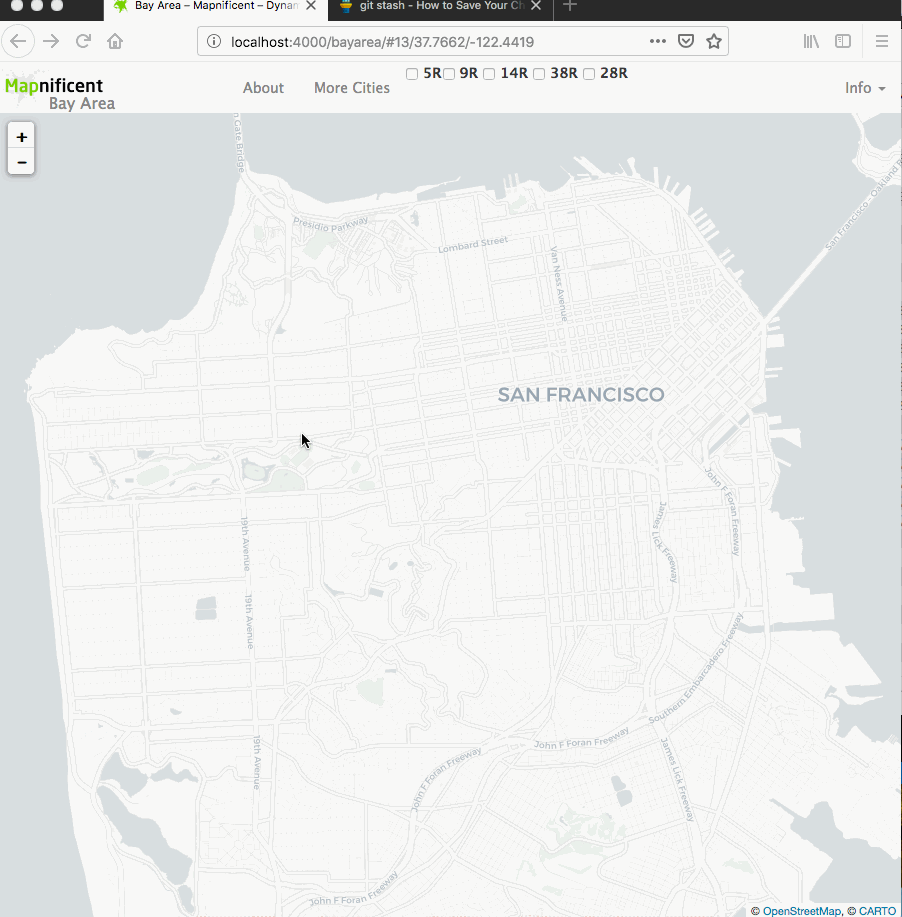

# Branch: static-gtfs-subsets
This branch filters the static schedule data on the frontend. The page starts out showing only the walking isochrone. 

Example:




The following sections show where code was added/updated and why it was done so:

## city.html
- <a href="https://github.com/vishalbakshi/mapnificent/blob/static-gtfs-subsets/_layouts/city.html#L31-L40">Lines 31-40 in `#mapnificent-navbar-collapse`</a>
    
    - what it does:
        - creates a list of checkboxes with route labels in the navigation bar at the top
    - why it was added:
        - allows users to select different routes 
- <a href="https://github.com/vishalbakshi/mapnificent/blob/static-gtfs-subsets/_layouts/city.html#L142-L161">Lines 142-161 in the script block</a>

    - what it does:
        - listens to changes in the checkbox state (checked/unchecked) 
        - calls `prepareData` with and the loaded data (`window.staticData`) and the array of selected route IDs
        - calls `startCalculation` on each `MapnificentPosition` object
    - why it was added:
        - this filters the data used by the app based on user selections
        
## mapnificent.js

- <a href="https://github.com/vishalbakshi/mapnificent/blob/static-gtfs-subsets/static/js/mapnificent.js#L183">Line 183 in the `MapnificentPosition.prototype.startCalculation` definition</a>

    - what it does:
        - I have called `this.triggerHashUpdate()`, which resets the URL of the map based on the new filtered data.
    
    - why it was added:
        - Without this line, upon clicking a route selection checkbox, the map would automatically move to the top left corner of the screen.

- <a href="https://github.com/vishalbakshi/mapnificent/blob/static-gtfs-subsets/static/js/mapnificent.js#L463-L470">Lines 463-470 in the `Mapnificent.prototype.prepareData` definition</a>

    - what it does:
        - filters the collection of Lines (routes) based on which checkboxes are selected by the use
    - why it was added:
        - In order to view isochrones for specific routes based on user selections
- <a href="https://github.com/vishalbakshi/mapnificent/blob/static-gtfs-subsets/static/js/mapnificent.js#L304">Line 304 in `Mapnificent.prototype.init` definition</a>

    - what it does:
        - saves a reference to the loaded data as a global variable
    - why it was added:
        - in order to call `prepareData` from the script block in `city.html`
       
# 30x30: Visualizing Rapid Network Service
This is the launchpad for building upon the proof of concept established during the SF DataJAM @ Code For America on Saturday, April 13, 2019.

DataJAM Outcome: <a href="https://docs.google.com/presentation/d/1Pm0a0NYYYtsFItfxuugKelZlJt3Z6Wwoy1wJS2nyM7E/edit?usp=sharing">Google Slides</a>

## Resources

- Mapnificent binary generator: https://github.com/mapnificent/mapnificent_generator
    - **Note: if you are converting the GTFS folder to binary using go, do not convert the GTFS folder to .zip**
        - ```go run mapnificent.go -d ~/gtfs/ -o bayarea.bin -v```
- Remix/Partridge (GTFS reader): https://github.com/remix/partridge
- GTFS data: https://transitfeeds.com/p/sfmta
- Adding mapnificent cities (in order to understand what goes into Mapnificent's data conversions): https://github.com/mapnificent/mapnificent_cities/tree/6363f4297febcb4e6bfe6544f577833d05e88564
- Go package that imports GTFS data into memory and web app that allows querying:
    - https://github.com/mapnificent/gogtfs

## Brainstorm

The following points oultine the different tasks/features that can be pursued for future development of this project.

What is the purpose of this tool?

- A tool where you can propose a Rapid transit route using GTFS and see the impact in a way that’s digestible by all stakeholders	
    - Precedent: https://www.mapnificent.net/sanfrancisco/#12/37.7100/-122.3664/1860/37.7730/-122.4031
    - Goals:
        - Change the data the Mapnificent frontend is receiving:
            - By adding new R routes
            - By removing existing R routes
        - In order to show:
            - Impacted area (different colors)
            - Impacted time (difference in areas)
        - Understand how the data is structured
            - https://github.com/mapnificent/mapnificent_cities/tree/6363f4297febcb4e6bfe6544f577833d05e88564
            - Questions to ask:
                    - What is the existing state?
                    - What is the impact of 30x30?
                    - What are the public comments?
- No matter what tool or feature you develop, first consider:
    - How is GTFS structured as it exists (static and realtime) (https://developers.google.com/transit/gtfs/#overview-of-a-gtfs-feed)
        - GTFS is a series if text files (usually collected/moved in a .zip file - mapnificent needs you to unzip the contents before use)
        - Each file contains a particular aspect of transport information 
            - agency.txt: a agency is identified by a agency_id
            - routes.txt: a route is maintained by under an agency (ie: sfmta). a route is identified by a route_id (ie: 1, 5, 5R, 8 etc)
            - trips.txt:  a route can take multiple trips. a trip is identified by trip_id. a trip is always under one route (ie: 8 towards Fisherman's Warf vs 8 towards City College)
            - stops.txt: a route stops here during a trip. multiple routes can be at the same stop. a stop is identified by stop_id (stop_times.txt references stops.txt but stops.txt doesn't reference stop_times.txt) (ie: Kearny and Geary, used by multiple routes such as 8, 30, 45; Brannan used by KT, N light rail muni lines)
            - stop_times.txt: tells us when a trip tops at a stop
            - shapes.txt: an optional file that describes the path a vehical. multiple rows in shapes help describe one overall vehicle path/shape. This is used by multiple trips and multiple routes  ie: describes a physical path that a vehicle can take) 
    - How would GTFS be structured to show future/predictive data
        - in order to change a route, one would need to query and add rows to the stop_times.txt, trips.txt, and routes.txt file. With mapnificent's current features, what times a bus reaches a stop would need to be calculated outside of the program.
- Potential tasks to explore when adding features
    - Explore ways to integrate existing GTFS tools to Mapnificent
        - i.e. a GTFS data management tool: https://github.com/WRI-Cities/static-GTFS-manager
    - Update the GTFS file, (i.e.remove Rapid routes, remove walking radii, etc.)
    - Run Mapnificent locally and feed the frontend new data
        - Refer to: https://github.com/mapnificent/mapnificent_generator
        - **Note: if you are converting the GTFS folder to binary using go, do not convert the GTFS folder to .zip**
            - ```go run mapnificent.go -d ~/gtfs/ -o bayarea.bin -v```
    - How will this new data (positively or negatively) the success of the 30x30 initiative?
    - How can we incorporate public feedback?
        - Example: http://www.letsbikeoakland.com/survey/#/
    - What are relevant precedents to 30x30 to consider/study?
        - Van Ness Improvement Project
            - https://www.sfmta.com/projects/van-ness-improvement-project
        - Geary Project
            - https://www.sfmta.com/projects/geary-boulevard-improvement-project
        - Underground M
            - https://www.sfmta.com/blog/subway-sfsu-our-plan-take-m-line-down-under
- Further questions to explore:
    - What are the impacts of public comments on the feasibility of 30x30 based on their area/neighborhood of interest?
    - How can we use this data and its visualization to communicate pros/cons of transit changes to those affected by those lines (residents, business, etc.)?
    - Which bus stops are utilized the most? What are the neighborhoods/businesses/demographics around those stops?
    - Are there other apps/forms that can plug into this larger visualization tool (this will expand the community input from other sources (in-person discussions, twitter, etc.))
    - Comparisons of theoretical transit performance vs actual transit performance
        - What are the discrepancies between the two?
        - Schedule GTFS vs realtime GTFS
        - Refer to: https://transitfeeds.com/l/68-san-francisco-ca-usa
    - How do we toggle 30x30 treatments in the visualization?
        - How can we translate these treatments to existing transit improvement realities/methodologies (SFMTA manual, construction techniques/costs, etc.)
            - e.g. this route takes 40 minutes, but with 30x30 treatments it takes 20 minutes!
            - Example: https://www.sfmta.com/projects/muni-forward
            - TTRP: Travel Time Reduction Proposals
            - How can the user toggle different modes of transportation in the visualization?
            - MUNI, car, bike, BART, walk
            - Where/how will these features be built? What data do we have? What data would be needed?


# Mapnificent

Install [bower](http://bower.io/) and [jekyll](http://jekyllrb.com/).

    # You need node and npm
    npm install -g bower
    # You need ruby and bundler
    bundle install

Then get the cities data:

<em>Note: if you want to use your own gtfs bin files, do not run the `git submodule` commands and instead place your .bin files into the appropriate `_cities/` folder</em>

    git submodule init
    git submodule update

Then run:

    bower install
    jekyll serve -w


## How to add a city

In order to add a transit system to Mapnificent, [GTFS data](https://developers.google.com/transit/gtfs/) for that transit system needs to be available without charge under a license that allows its use with Mapnificent. If you find data for a city that is not on Mapnificent, [please follow the steps outlined in the Mapnificent City repository.](https://github.com/mapnificent/mapnificent_cities/blob/master/README.md)
