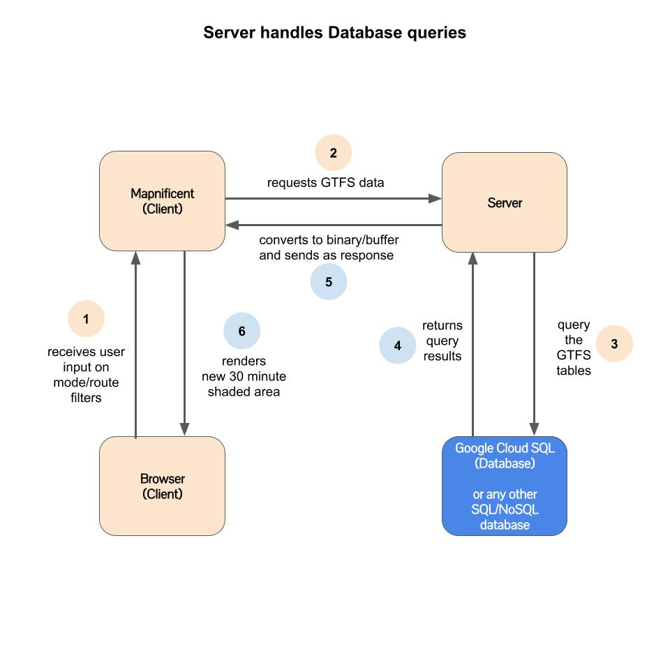

# Notes - App Architecture - 20190415

**TL;DR**
<blockquote>
How we want to structure our data will determine how we build out the pipelines using which tools. Do we want to keep everything in SQL or NoSQL? What are the pros/cons of each? What would make it easier for more developers, data analysts, data scientists, etc to contribute to this project? What would align most with the skillsets/comfort-zones/familiarity of our core team?
  </blockquote>

-----
**20190424 Update** In addition to the ideas listed below, <a href="https://github.com/vishalbakshi/mapnificent-generator-server">here's an initial version of a Go server</a> which does the following:

  - Retrieves the zip file from transitfeeds.com
  - Saves it locally
  - Converts it to the structured .bin using `mapnificent.go`

We could have this server running and direct the <a href="https://github.com/vishalbakshi/mapnificent/blob/master/static/js/mapnificent.js#L392">`dataURL` in mapnificent.js</a> to this server in order to fetch the .bin file.

This would work well for schedule data, but for user interactions we would have to incorporate something that did the following:

  - Received user interactions (selection of UI elements to filter the data), for example: selecting different routes
  - Send those queries to a database (Firestore may be a better option than Cloud SQL to keep it all front-end scripts)
  - Convert those query results to .txt or similar file
  - and then send it off to this Go server to run the data through `mapnificent.go`

----
The longer version---

I'm currently working on building out a single (rough draft) GTFS "microservice" which does the following (checked items are already completed and passed tests, hot diggity!):

  - [X] Request and retrieve GTFS files from API provided by transitfeeds.com 
  - [X] Upload GTFS zip file to Google Cloud/Firebase Storage
  - [ ] Download from Google Cloud/Firebase Storage and prepare data for Cloud SQL
  - [ ] Insert data into Google Cloud SQL database
  - [ ] Receive query/params from client's GET request and query Cloud SQL
  - [ ] Convert query results to Protocol Buffer
  - [ ] Send Protocol Buffer as response to Mapnificent

Here's the repo: https://github.com/vishalbakshi/gtfsapi/tree/version2

I think those 7 features would be the extent of what a generalized but basic "GTFS API" should be able to do for our Mapnificent embed.

However, I think those features, instead of being handled by a single microservice, can eventually be split up/altered into smaller pieces. Also, we may not need all of those features immediately. I'm having a hard time looking past the generalized version.

There are two distinct functionalities that we need:

1. Retrieve GTFS files in some file format from some third-party source (transitfeeds.com or equivalent)
2. Query and send GTFS data to Mapnificent client based on user inputs

Either the Client (browser-based Mapnificent) or Server (some standalone server we host in Firebase or Heroku or etc.) can handle one or both of those functionalities. I am not exactly sure what all the tradeoffs would be, or how relevant they would be for our purposes. My only assumption is that we want to make something robust/maintainable/expandable, so here are different scenarios:

## Functionality 1: Retrieve GTFS files

### Option 1

### Option 2

## Functionality 2: Query and send GTFS data to Mapnificent
### Option 1

### Option 2

Other than the cool colors, the main tradeoff seems to be in what structure and location the data will be stored. 
