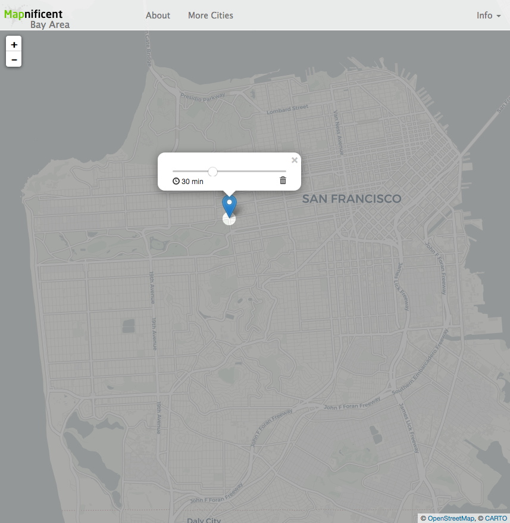
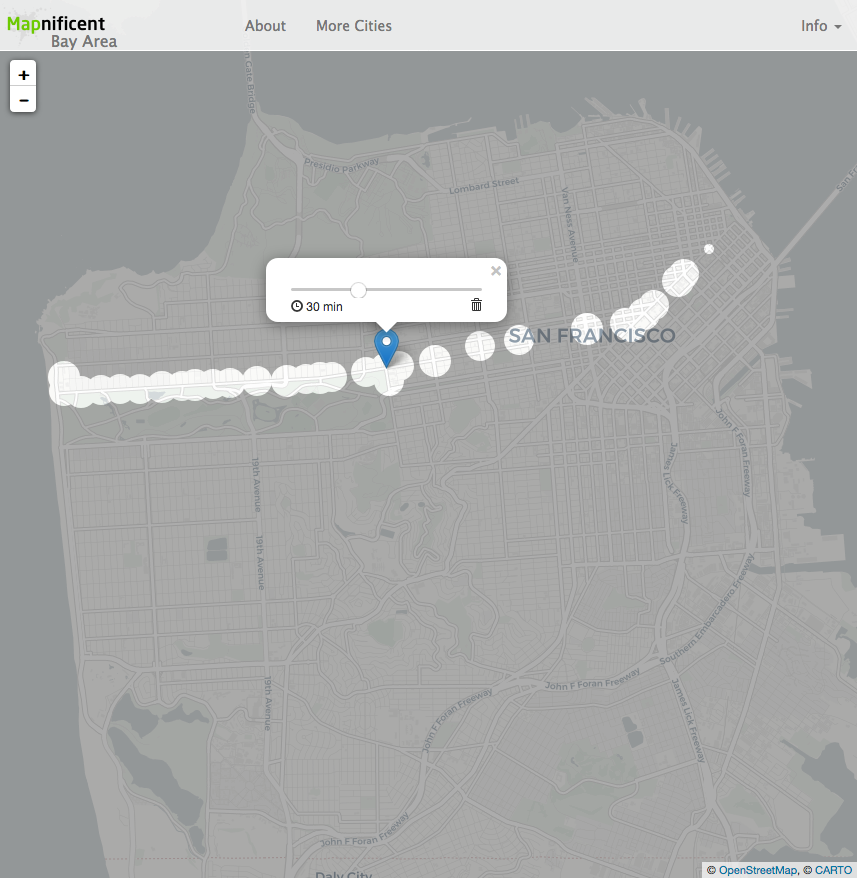
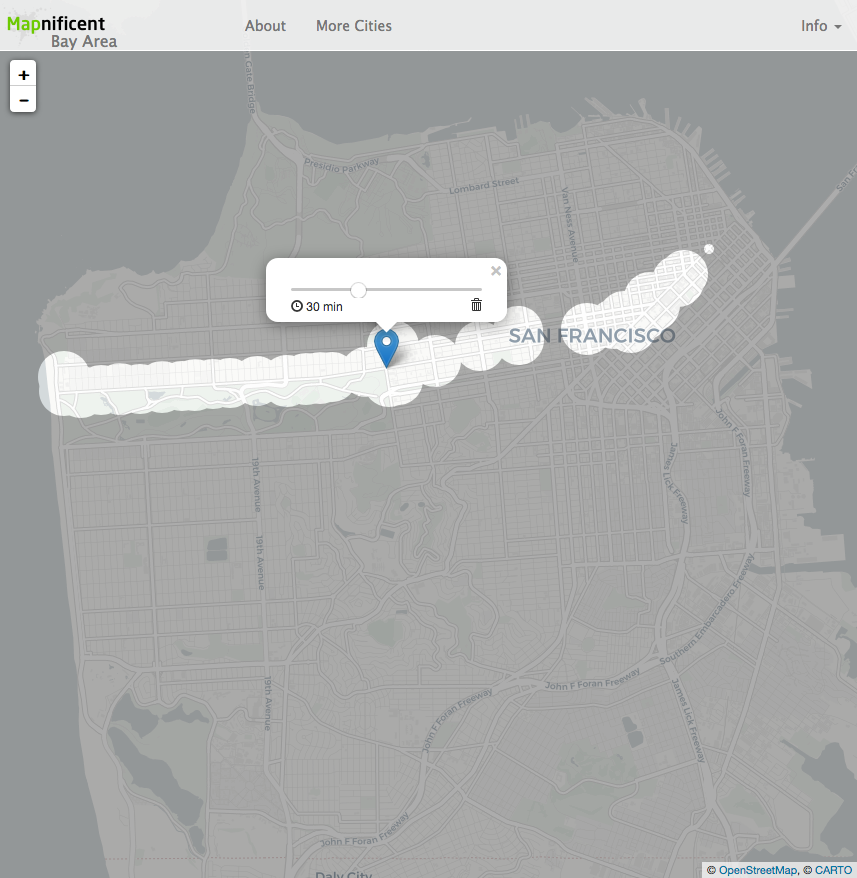
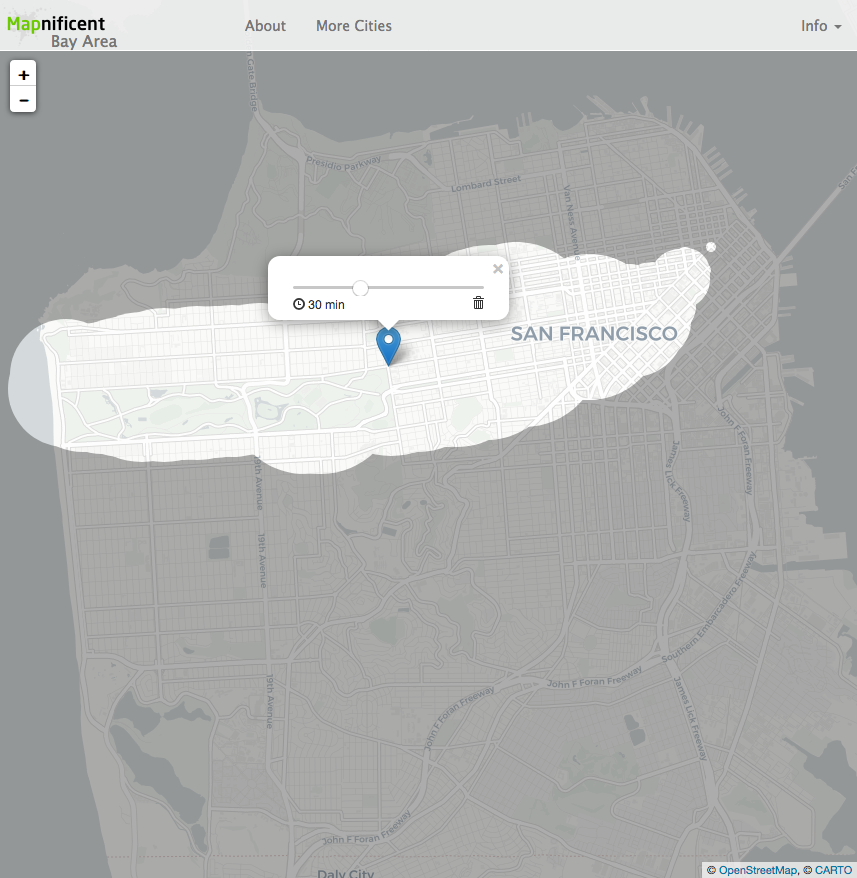
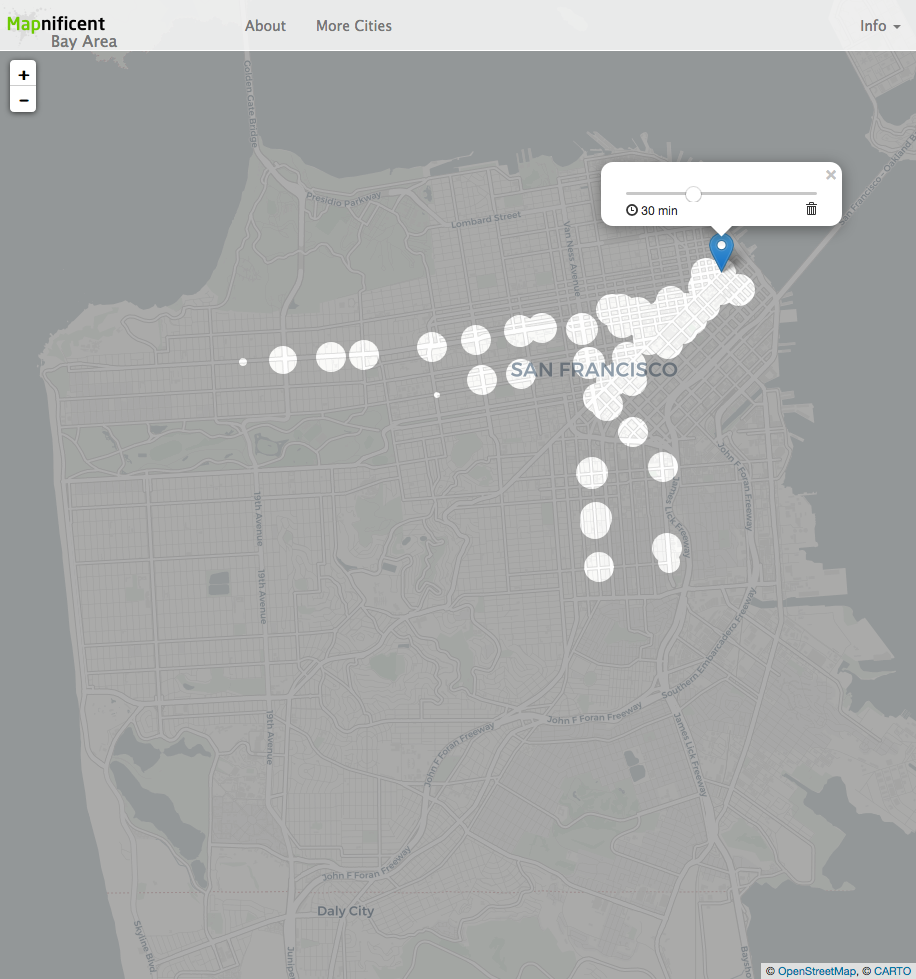

# Notes - DataConversions - 20190419 - GTFS Data Subsets

## General info on Feed Files
Source: https://developers.google.com/transit/gtfs/reference/#feed-files

## Relevant SQL queries
  - Create GTFS tables
    - (still in progress): https://github.com/vishalbakshi/gtfsapi/blob/version2/databaseQueries.js
  - Import GTFS data into db tables:
    - Queries/scripts can be found <a href="https://github.com/vishalbakshi/gtfsapi/tree/version2/database_queries">at this repo</a>
  - Queries to extract various subsets
    - Reference: https://gist.github.com/akirattii/86e2eda8e110976cce144c991e9cada8
   
## Subsets

The following screenshots show the resulting renders from different subsets of GTFS data

The following folder contains .bin files for the different subsets: https://drive.google.com/drive/folders/1S781kpMOQqqse3x8DMkRuDsw-o78RMl5?usp=sharing

### Subset 1: 5R Route Only

  - Changes to data:
    - All rows except for header and 5R route deleted from routes.txt
    - `go run mapnificent.go -d "/path/to/gtfs" -o "bayarea.bin"`
  - Changes to `_cities/` folder:
    - replace existing `bayarea.bin` with new file
    
#### Stanyan and Fulton: 1 minute walking @ a pace of 13 minutes/km

  - Changes to `_site/static/js/mapnificent.js`:
    - Line 288: `mapWalkTime` set to `1 * 60`
    

#### Stanyan and Fulton: 3 minute walking @ a pace of 13 minutes/km

  - Changes to `_site/static/js/mapnificent.js`
    - Line 288: `mapWalkTime` set to `3 * 60`

#### Stanyan and Fulton: 5 minute walking @ a pace of 13 minutes/km

  - Changes to `_site/static/js/mapnificent.js`
    - Line 288: `mapWalkTime` set to `5 * 60`

#### Stanyan and Fulton: 15 minute walking @ a pace of 13 minutes/km

  - Changes to `_site/static/js/mapnificent.js`
    - Line 288: `mapWalkTime` set to `15 * 60`

### Subset 2: Rapid Routes Only
  - Changes to data:
    - All rows except for header and all Rapid routes (9R, 14R, 5R, 38R, 28R) deleted from routes.txt
    - `go run mapnificent.go -d "/path/to/gtfs" -o "bayarea.bin"`
  - Changes to `_cities/` folder:
    - replace existing `bayarea.bin` with new file
#### Beale and Market: 5 minutes walking @ a pace of 13 minutes/km
  - Changes to `_site/static/js/mapnificent.js`
    - Line 288: `mapWalkTime` set to `5 * 60`

### Subset 3: TBD

## GTFS Schemas (first draft, based on data files from https://transitfeeds.com/p/sfmta/942/latest/download)

##### Example GTFS files:
  - trips.txt: https://drive.google.com/open?id=1NhMtBpLQJFoDZzbolneivDD0Baz1sBiR0TIqZTrrWgI
  - all other .txts: https://drive.google.com/open?id=1KYsMOWhxUVZ9Hm4S9Jqfi1Mra9U6ukwf0mF6TSvHhGE
### Tables or Collections

#### AGENCY (from `agency.txt`)
  - `agency_id`: `string` or `VARCHAR(5)`, unique, optional
  - `agency_name`: `string`or `VARCHAR(45)`, required
  - `agency_url`: `string` or `VARCHAR(17)`, required
  - `agency_timezone`: `string` or `CHAR(19)`, required
  - `agency_lang`: `string` or `VARCHAR(2)`, optional

#### STOPS (from `stops.txt`)
  - `stop_id`: `string` or `VARCHAR(4)`, unique, required
  - `stop_code`: `string` or `VARCHAR(5)`, optional
  - `stop_name`: `string` or `VARCHAR(100)`, required
  - `stop_desc`: `string` or `VARCHAR(100)` ,optional
  - `stop_lat`:  `double` or `FLOAT(8,6)`, required
  - `stop_lon`: `double` or `FLOAT(9,6)`, required
  - `zone_id`: `string` or `VARCHAR(100)`, optional
  - `stop_url`: `string` or `VARCHAR(100)`, optional
  - `location_type`: `number` or `INT`, optional
  - `parent_station`: `string` or `VARCHAR(4)`, optional
  - `stop_timezone`: `string` or `VARCHAR(100)`, optional
  - `location_type`: `number` or `INT`, optional
  - `platform_code`: `string` or `VARCHAR(100)`, optional
  
#### ROUTES (from `routes.txt`)
  - `route_id`: `string` or `VARCHAR(5)`, required
  - `agency_id`:  `string` or `VARCHAR(5)`, optional
  - `route_short_name`: `string` or `VARCHAR(5)`, conditionally required
  - `route_long_name`: `string` or `VARCHAR(100)`, conditionally required
  - `route_desc`: `string` or `VARCHAR(100)`, optional
  - `route_type`: `number` or `INT`, required
  - `route_url`: `string` or `VARCHAR(100)`, optional
  - `route_color`: `string` or `VARCHAR(100)`, optional
  - `route_text_color`: `string` or `VARCHAR(100)`, optional
  - `route_sort_order`: `number` or `INT`, optional

#### TRIPS (from `trips.txt`)
  - `route_id`: required, foreign key (`route_id` in ROUTES)
  - `service_id`: required, foreign key (`service_id` in CALENDAR or CALENDARDATES)
  - `trip_id`: required
  - `trip_headsign`: optional
  - `trip_short_name`: optional
  - `direction_id`: optional
  - 'block_id`: optional
  - 'shape_id`: optional, foreign key (`shape_id` in SHAPES)
  - 'wheelchair_accessible`: optional
  - `bikes_allowed`: optional
  
#### STOPTIMES (from `stop_times.txt`)
  - `trip_id`: required, foreign key (`trip_id` in TRIPS)
  - `arrival_time`: required
  - `departure_time`: required
  - `stop_id`: required, foreign key (`stop_id` in STOPS)
  - `stop_sequence`: required
  - `stop_headsign`: optional
  - `pickup_type`: optional
  - `drop_off_type`: optional
  - `shape_dist_traveled`: optional
  - `timepoint`: optional

#### CALENDAR (from `calendar.txt`)
  - `service_id`: required
  - `monday`: required
  - `tuesday`: required 
  - `wednesday`: required
  - `thursday`: required
  - `friday`: required
  - `saturday`: required
  - `sunday`: required
  - `start_date`: required
  - `end_date`: required

#### CALENDARDATES (from `calendar_dates.txt`)
  - `service_id`: required
  - `date`: required
  - `exception_type`: required

#### FAREATTRIBUTES (from `fareattributes.txt`)
  - `fare_id`: required
  - `price`: required
  - `currency_type`: required
  - `payment_method`: required
  - `transfers`: erquired
  - `agency_id`: optional
  - `transfer_duration`: optional

#### FARERULES (from `farerules.txt`)
  - `fare_id`: required, foreign key (`fare_id` in FAREATTRIBUTES)
  - `route_id`: optional
  - `origin_id`: optional
  - `destination_id`: optional, foreign key (`zone_id` in STOPS)
  - `contains_id`: optional

#### SHAPES (from `shapes.txt`)
  - `shape_id`: required
  - `shape_pt_lat`: required
  - `shape_pt_lon`: required
  - `shape_pt_sequence`: required
  - `shape_dist_traveled`: optional
 
#### FREQUENCIES (from `frequencies.txt`)
  - `trip_id`: required, foreign key (`trip_id` in TRIPS)
  - `start_time`: required
  - `end_time`: required
  - `headway_secs`: required
  - `exact_times`: optional

#### TRANSFERS (from `transfers.txt`)
  - `from_stop_id`: required, foreign key (`stop_id` in STOPS)
  - `to_stop_id`: required, foreign key (`stop_id` in STOPS)
  - `transfer_type`: required
  - `min_transfer_time`: optional
  
#### FEEDINFO (from `feed_info.txt`)
  - `feed_publisher_name`: required
  - `feed_publisher_url`: required
  - `feed_lang`: required
  - `feed_start_date`: optional
  - `feed_end_date`: optional
  - `feed_version`: optional
  - `feed_contact_email`: optional
  - `feed_contact_url`: optional
